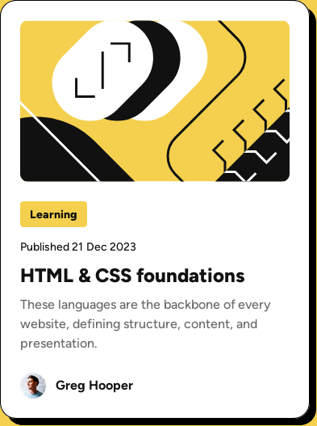

# Frontend Mentor - Blog preview card solution

This is a solution to the [Blog preview card challenge on Frontend Mentor](https://www.frontendmentor.io/challenges/blog-preview-card-ckPaj01IcS). Frontend Mentor challenges help you improve your coding skills by building realistic projects.

## Table of contents

- [Overview](#overview)
  - [The challenge](#the-challenge)
  - [Screenshot](#screenshot)
  - [Links](#links)
- [My process](#my-process)
  - [Built with](#built-with)
  - [What I learned](#what-i-learned)
- [Author](#author)

## Overview

### The challenge

Users should be able to:

- See hover and focus states for all interactive elements on the page

### Screenshot



### Links

- Solution URL: [https://github.com/mickael-o3o/Blog-preview-card-solution.git](https://github.com/mickael-o3o/Blog-preview-card-solution.git)
- Live Site URL: [Add live site URL here](https://mickael-o3o.github.io/Blog-preview-card-solution)

## My process

### Built with

- [Vuejs](https://vuejs.org)
- [Sass](https://sass-lang.com)
- Mobile-first workflow

### What I learned

Calculate an element's size based on other element's size.

```css
.illustration-article {
  max-width: calc(var(--card-width) - (var(--space-200) * 2));
  border-radius: calc(10 / var(--font-size-paragraph) * 1rem);
}
```

### Continued development

Calculate element's based on root font-size.

## Author

- Frontend Mentor - [@mickael-o3o](https://www.frontendmentor.io/profile/mickael-o3o)
